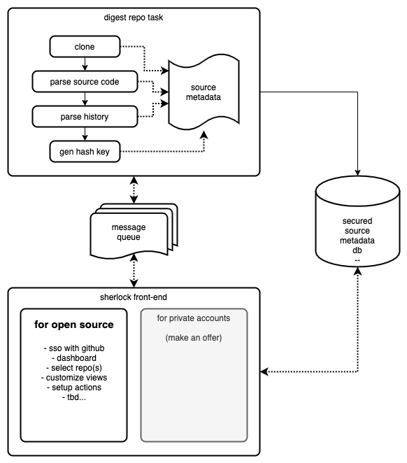

# Sherlock Code Inspector

The source code inspector is back in town. \o/

Sherlock service overview, for open source projects at least ...

## ToDo list

* [x] parse directory tree, gather size, loc, etc
* [x] generate cluster chart from json
* [x] parse sources for imports
* [x] parse sourced for nested blocks
* [x] show inspector metadata when selecting a file
* [x] aggregate analysis metadata up to project root
* [x] detect indentation width
* [x] dockerize
* [x] a smarter import resolution

* [ ] improve coupling based on usage of top-level symbols
* [ ] run analysis as a service
* [ ] add support for cloning a git repo and run analysis on it
* [ ] filtering

* [ ] improve UI layout
* [ ] render a project as static portable html
* [ ] complexity trends
* [ ] symbolic wordcloud

* [x] parse c/c++/obj-c files
* [x] parse python files
* [x] parse java/kotlin files
* [ ] add swift parser
* [ ] add C# parser
* [ ] add go parser
* [ ] add javascript parser

* [ ] external libraries report

* [ ] add a view to display aggregated data
* [ ] add an admin (or restricted) view for adding a new git repo url
